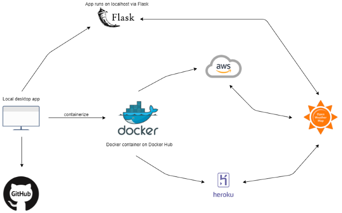

## Ever want to build your own weather application? This "What's the Weather in Your City?" App is the perfect place to start! 
  
[Check out the working model here](https://venuto-weather.herokuapp.com)  

This app allows you to query the weather in any city across the world via the OpenWeatherMap API. You can search by city, zip code, and country to view the coordinates, temperature, and current weather conditions in that location.
  
This is a fun application that can be easily built upon, and thanks to its containerized functionality, you can deploy it to any cloud platform of your liking. Use this application to search for current weather, as well as build on it to include more weather functionality!
  
Check out this cloud architecture model to get an idea of how the application interacts with cloud and API services:
  

